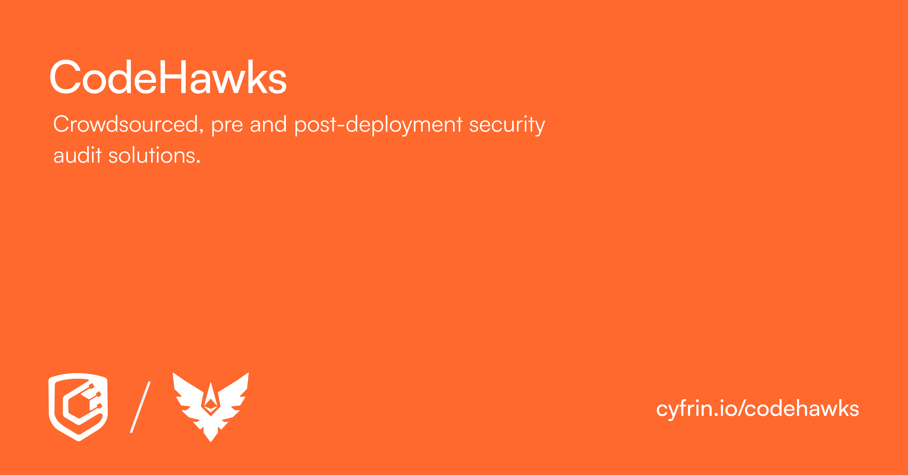

    

  

  

    I’m a smart contract security auditor focused on continuous assurance for codebases and on delivering security services:
    manual review, invariant testing and fuzzing, gas optimizations and safe production releases.
  

---

## 𖢻 EVM Audits
I am mostly focused on EVM audits written in Solidity. Here are some of the best codebases I have audited.

- 🔷 Chainlink Rewards: https://github.com/rubencrxz/Chainlink-Rewards

- 💧 Lido Finance: https://github.com/rubencrxz/Lido-Finance

- 🌊 Fluid DEX V2: Report done. Waiting for results...

- 🐲 Hybra Finance (HyperEVM): https://github.com/rubencrxz/Hybra-Finance

- ♾️ Ekubo Protocol: https://github.com/rubencrxz/Ekubo

## 🦀 non-EVM Audits
I have also performed some audits in Rust language, getting some High and Medium Findings:

- 🔒 Swafe (ZK): Report done. Waiting for results...
 
- ®️ Reflector V3 (Stellar): https://github.com/rubencrxz/Reflector

## 💢 Audits with live/deployed code

- 🪽 Morpheus: https://github.com/rubencrxz/Morpheus

## 📖 Technichal Reports
As part of my research, I deeply study the best protocols in the ecosystem.

- 🦄 Uniswap: https://github.com/rubencrxz/Uniswap

- 𖢻 EVM: Coming soon...

 

## 🏆 Public Contest (Stats)

| Platform                                                                  | Valid Bugs (H&M)    | My Reviews |
| ------------------------------------------------------------------------  |  -------------      | ---------- |
| 🧲 [Cantina](https://cantina.xyz/u/rubencrxz)                             | 1 M                 | [View Reports](https://github.com/rubencrxz/Cantina-Reports)    |
| 🟪 [Code4rena](https://code4rena.com/@rubencrxz)                          | 2 H                 | [View Reports](https://github.com/rubencrxz/Code4rena-Reports)  |
| 🕵🏻‍♂️ [Sherlock](https://audits.sherlock.xyz/watson/rubencrxz)               | 2 M                 | [View Reports](https://github.com/rubencrxz/Sherlock-Reports)   |

## ✈️ First Flight Contest

<table>
  <tr>
    <td width="150">
      
    </td>
    <td valign="middle">
      <a href="https://github.com/rubencrxz/codehawks-firstflights" target="_blank"
         style="font-size:1.3em; font-weight:bold; color:#0366d6; text-decoration:none;">
        My First Flight Audits
      </a>
    </td>
  </tr>
</table>
