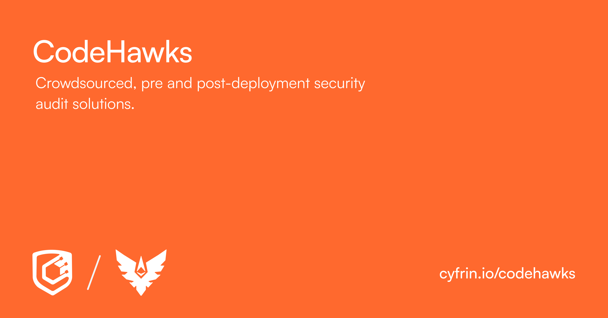

    

  

  

    I’m a smart contract security auditor that provides continuous smart contract security assurance for production codebases, combining manual review, invariant testing and fuzzing, gas optimization, and support for safe production releases.
  

---

## 𖢻 EVM Audits

My primary focus is EVM security reviews, auditing Solidity codebases. These are reports of some prtocolos I have audited:

- 🔷 Chainlink Rewards: https://github.com/rubencrxz/Chainlink-Rewards

- 💧 Lido Finance: https://github.com/rubencrxz/Lido-Finance

- 🌊 Fluid DEX V2: Report done. Waiting for results...

- 🐲 Hybra Finance (HyperEVM AMM): https://github.com/rubencrxz/Hybra-Finance

- ♾️ Ekubo Protocol (AMM): https://github.com/rubencrxz/Ekubo

- ➕ Ammplify (AMM): https://github.com/rubencrxz/Ammplify

- ©️ Covenant (DEX): https://github.com/rubencrxz/Covenant
---

## 🦀 non-EVM Audits

I have also audited some Rust-based systems, getting some High and Medium valid Findings:

- 🔒 Swafe (ZK): Report done. Waiting for results...
 
- ®️ Reflector V3 (Stellar): https://github.com/rubencrxz/Reflector

---

## 💢 Audits with live/deployed code

I also run audits against live, deployed code.

- 🪽 Morpheus: https://github.com/rubencrxz/Morpheus

---

## 📖 Technichal Reports

As part of my research, I study top-tier protocols in depth and document the key technical and architectural ideas behind them.

- 🦄 Uniswap: https://github.com/rubencrxz/Uniswap

- 👻 Aave V3: https://github.com/rubencrxz/Aave

- 𖢻 EVM: https://github.com/rubencrxz/EVM

---

## 🏆 Public Contest (Stats)

Currently participating in public audit contests across Sherlock, Code4rena, and Cantina.

| Platform                                                                  | Valid Bugs (H&M)    | My Reviews |
| ------------------------------------------------------------------------  |  -------------      | ---------- |
| 🧲 Cantina                                                                | 1 M                 | [View Reports](https://github.com/rubencrxz/Cantina-Reports)    |
| 🟪  Code4rena                                                             | 2 H                 | [View Reports](https://github.com/rubencrxz/Code4rena-Reports)  |
| 🕵🏻‍♂️  Sherlock                                                              | 3 M                 | [View Reports](https://github.com/rubencrxz/Sherlock-Reports)   |

## ✈️ First Flight Contest

<table>
  <tr>
    <td width="150">
      
    </td>
    <td valign="middle">
      <a href="https://github.com/rubencrxz/codehawks-firstflights" target="_blank"
         style="font-size:1.3em; font-weight:bold; color:#0366d6; text-decoration:none;">
        My First Flight Audits
      </a>
    </td>
  </tr>
</table>
